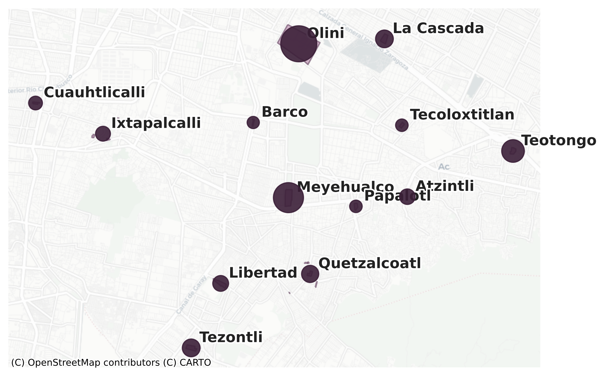
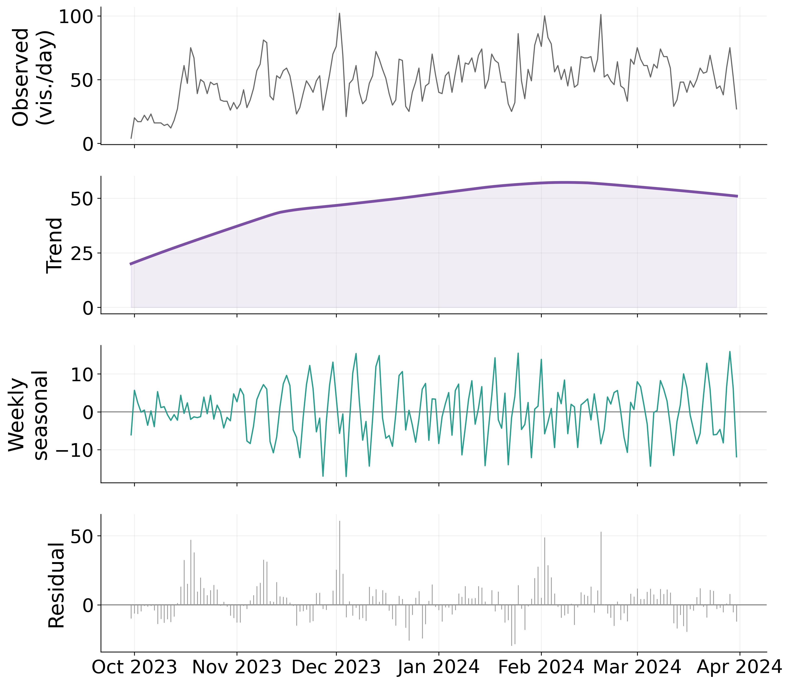
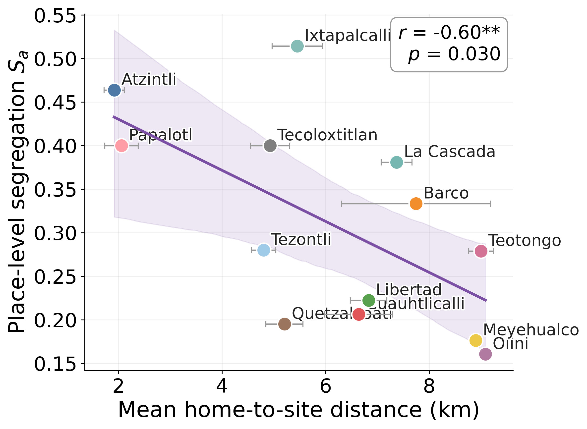
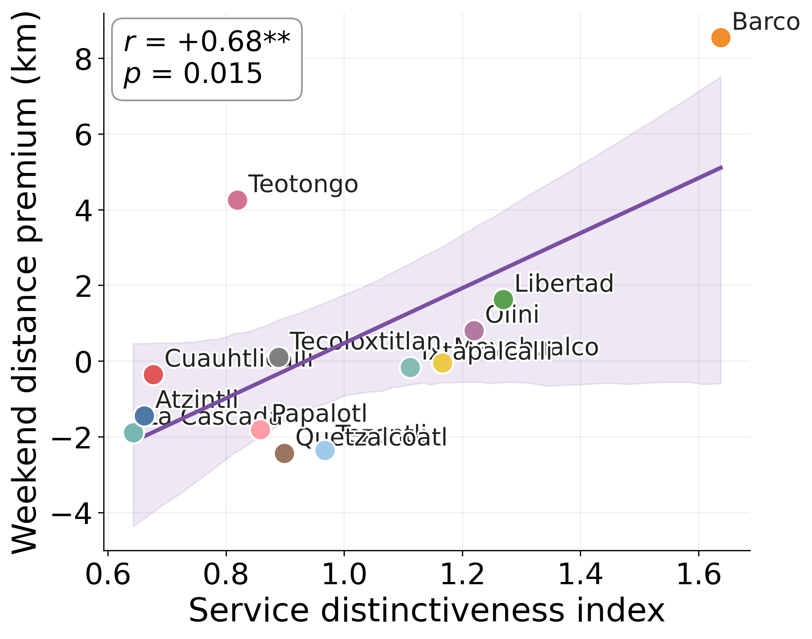
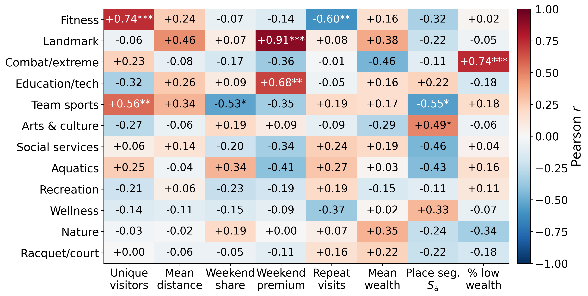
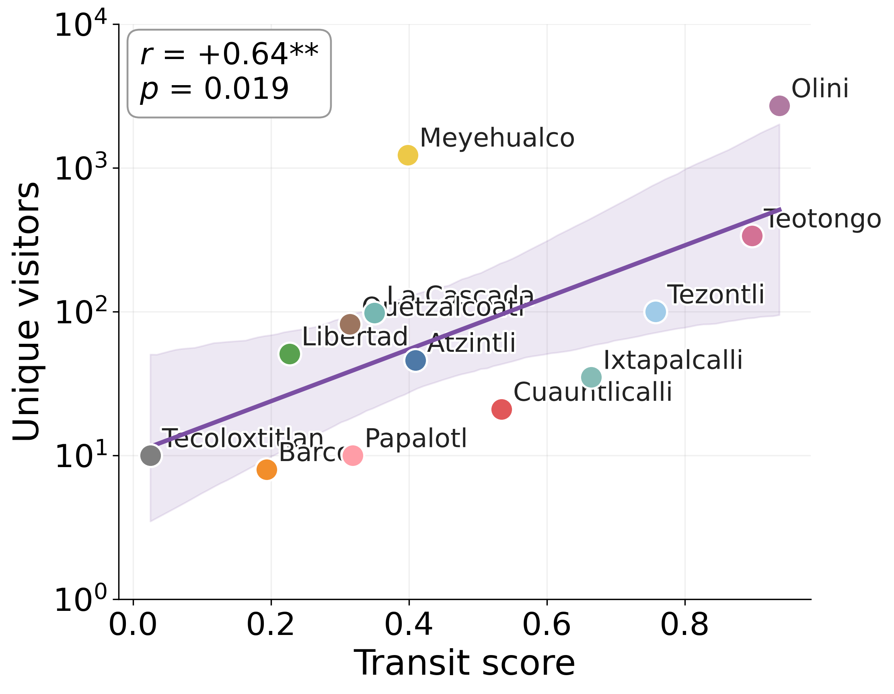
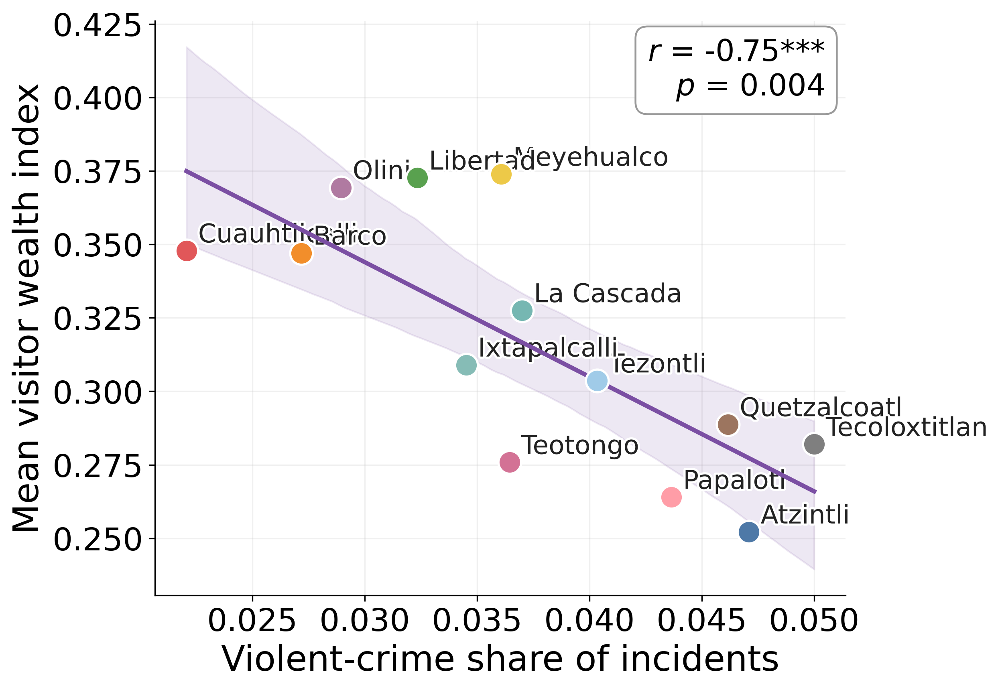
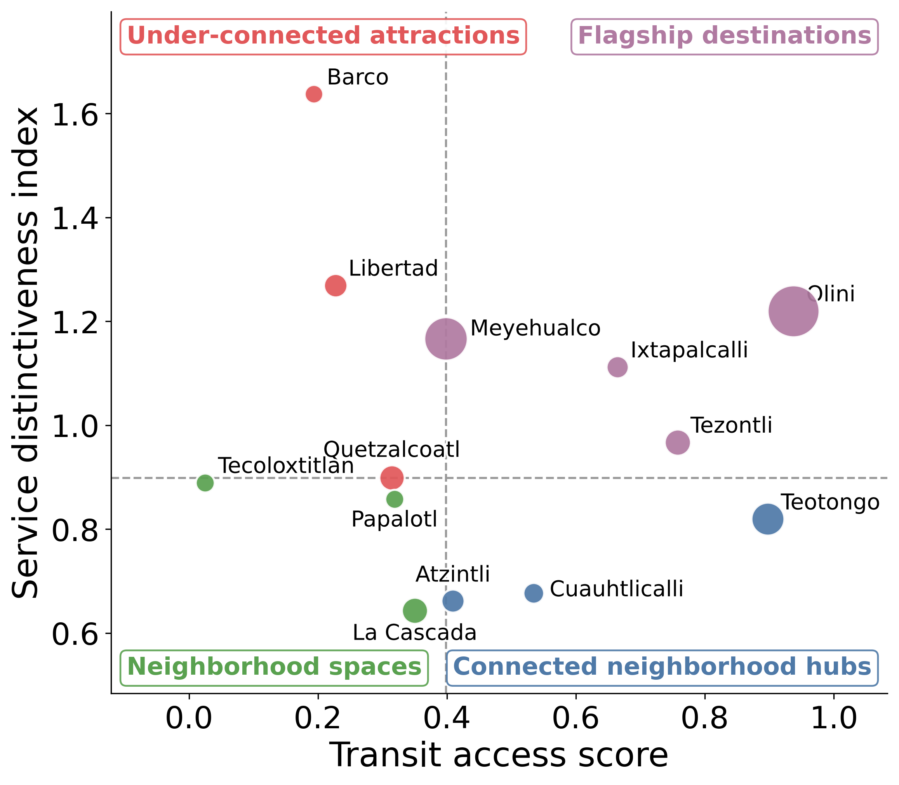

# Evaluating the Reach and Equity of Public Spaces in Mexico City Using Mobility Data: The Utopías of Iztapalapa

Public space is one of the most direct levers a city government has for
redistributing well-being, but the value of a facility is realized only through
use, and use depends on who can reach it. We bring high-resolution human
mobility data from Location-Based Services (LBS) to the Utopías of Iztapalapa, a
network of thirteen free recreation, culture and care facilities built on the
eastern periphery of Mexico City, and ask whom the network reaches and what
separates the sites that draw from across the city from those used almost
entirely by the people who live around them. Joining LBS traces with a
census-derived wealth map, a public transit feed (GTFS), an open crime registry
and a hand-built activity catalog, we find that transport access, service
distinctiveness and surrounding safety each track a different facet of reach.
Transit supply is the strongest correlate of visitor volume; specialized
signature attractions do not raise daily footfall but pull visitors from farther
away on weekends; and the violent share of surrounding crime tracks the
socioeconomic composition of visitors rather than their number. Every
relationship is a correlation over the thirteen sites in a single six-month
window (late September 2023 to the end of March 2024), read as an association
rather than a cause.

This repository holds the processed per-site data and the code that turns it
into the results of the paper.

## Data

Everything is aggregated to the site level. No individual traces are included.

- `data/utopias_summary.csv` — one row per Utopía: unique visitors, home-to-site
  distances, wealth mix, place-level segregation `S_a`, and the transit, service
  and crime summaries joined together.
- `data/transit_metrics.csv` — per-site public transport supply within the
  300 m, 500 m and 1 km buffers (stops, routes, modes, weekday and weekend trips,
  headways, metro and BRT presence, and the composite transit score).
- `data/crime_metrics.csv` — per-site crime counts by category within the 1 km
  buffer, the density per square kilometre and the violent share.
- `data/service_items.csv` — the facility catalog in long form, with each
  facility's service domain, empirical rarity and infrastructure intensity.
- `data/service_categories.csv` — the category-level rarity, infrastructure and
  distinctiveness weights.
- `data/README_taxonomy.md` — how the facility catalog was harmonized and scored.

The transit and crime tables are the processed inputs behind the transit and
crime columns of the summary; the notebook reads them directly for the
per-category crime analysis.

## Requirements

Python 3.9+ and the packages in `requirements.txt`. The notebook renders with
[Quarto](https://quarto.org).

## Usage

```
quarto render src/utopias_analysis.qmd
```

The notebook loads the per-site table, reproduces the headline correlations, the
partial correlations and the standardized regression, and writes the analytic
panels into `figs/`. The helper functions live in `src/data.py`, `src/stats.py`
and `src/figures.py`.

## Key results

### The network and who it reaches



Two flagship sites, Olini and Meyehualco, hold most of the traffic, roughly 2,700
and 1,200 unique visitors out of 4,704 across the network. About fifty-five
percent of visitors come from outside Iztapalapa, and roughly one in five from
the neighbouring municipalities of the State of Mexico, but that metropolitan
catchment sits almost entirely at the two largest hubs; the smallest sites are
over ninety percent local.

### Visits build slowly over the season, not week to week



Daily visits rise from about twenty per day in October to a smoothed peak near
sixty in early February before easing. The weekly cycle is weak, under one
visitor per day between weekend and weekday averages.

### Wider catchments come with a more even wealth mix



Place-level segregation `S_a` falls as the mean home-to-site distance grows
(r = -0.60, p = 0.030): sites that draw from farther attract a more even mix of
the four metropolitan wealth quartiles.

### The offer tracks travel distance, not volume



The distinctiveness of a site's offer is unrelated to how many people come
(r = 0.05) but tracks the weekend distance premium (r = 0.68, p = 0.015). At the
domain level the landmark attractions carry this the hardest (r = 0.91,
p < 0.001).



### Transit supply is what tracks volume



The composite transit score is the strongest single correlate of unique visitors
(r = 0.64, p = 0.019), while a conventional distance-weighted accessibility index
shows no relationship (r = -0.12). Controlling for services and crime leaves the
transit link intact (partial r = 0.65, p = 0.016). A standardized regression of
log visits on the three axes gives transit 0.65, services 0.15 and crime -0.02
(R² = 0.44).

### Violence tracks who comes, not how many



The volume of surrounding crime is unrelated to visits (r = -0.01). The violent
share is what matters, and it tracks the wealth of who comes (r = -0.75,
p = 0.004) and how far they travel (r = -0.64, p = 0.019): poorer, more local
visitors at the high-violence sites, wealthier and more mobile ones at the safer,
better-connected ones.

### A typology from the two policy levers



Crossing transit access with service distinctiveness, the two levers a planner
controls directly, splits the network into flagship destinations, connected
neighborhood hubs, under-connected attractions and neighborhood spaces.

## Authors

- Ollin D. Langle-Chimal, University of California, Berkeley ([@ollin18](https://github.com/ollin18))
- Natalia Cadavid-Aguilar, Tecnológico de Monterrey
- Alberto Meouchi-Vélez, Tecnológico de Monterrey
- Roberto Ponce-López, Tecnológico de Monterrey

## Contact

Ollin D. Langle-Chimal, ollin@berkeley.edu
